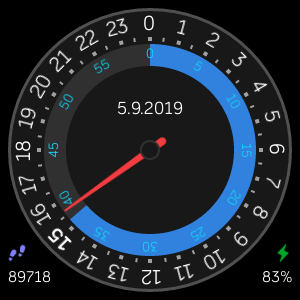

# [twentyfour](https://gallery.fitbit.com/details/993e4b9a-4491-46e3-8b29-48bf37ad796f)

A 24-hour clock face for the [Fitbit Versa](https://www.fitbit.com/fi/shop/versa) watch.

## Project setup

NodeJS + yarn is required; as well as the Fitbit OS Simulator ([windows](https://simulator-updates.fitbit.com/download/latest/win), [mac](https://simulator-updates.fitbit.com/download/latest/mac)). You can also use your watch via the CLI; info on setting that up can be found in the [Getting Started](https://dev.fitbit.com/getting-started) section of Fitbits dev portal.

- Clone project.
- Generate a new app identifier via `npx fitbit-build generate-appid`
- Build via `npx fitbit-build`

### Workflow

- Open up the simulator or connect your watch to the dev bridge
- In the project, open up the cli via `npx fitbit`
- After making changes, install it via `build-and-install`
